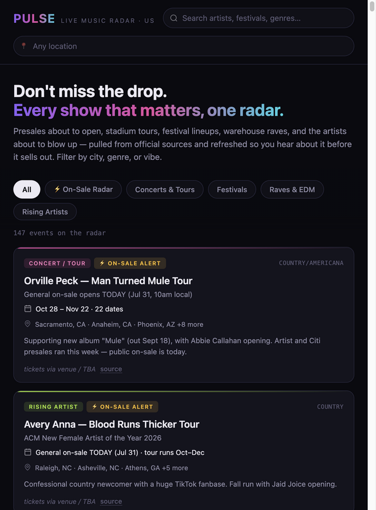

# PULSE — Live Music Radar

A single-file US live-music discovery page: presales about to open, stadium tours,
festival lineups, warehouse raves, and rising artists — all in one filterable radar.



## What's in it

`index.html` is fully self-contained (one file, no build step, no dependencies).
It holds **147 events** in a `const EVENTS` array, delimited by `// DATA_START`
and `// DATA_END` near the top of the inline `<script>`:

| Category    | Count |
| ----------- | ----- |
| Concerts & tours | 62 |
| Raves & EDM      | 34 |
| Festivals        | 29 |
| Rising artists   | 22 |

Each entry carries a title, subtitle, date window, details, genre, city list, an
official ticket link, and a source URL.

## Features

- Free-text search across artists, festivals and genres
- City autocomplete backed by a generated `<datalist>`
- Filter chips: All · ⚡ On-Sale Radar · Concerts & Tours · Festivals · Raves & EDM · Rising Artists
- Per-event flags — `radar` (presale/on-sale imminent), `hot`, `now`
- Live result count and an empty state

## Running it

Open `index.html` in a browser. That's the whole thing.

## Updating the data

Edit the array between `// DATA_START` and `// DATA_END`. An entry looks like:

```js
{
  cat: 'concert',              // concert | festival | edm | rising
  flags: ['radar'],            // radar | hot | now
  title: "Artist — Tour Name",
  sub: "One-line hook",
  when: "Date window",
  details: "Longer description",
  genre: "pop",
  cities: ["Los Angeles, CA"],
  tix: "https://…",            // or null
  src: "https://…"             // source announcement
}
```

Also bump the `Updated <b>…</b>` date in the header when you refresh the data.

## Known gaps

- **The data is static.** The footer says "Auto-refreshed by Claude", but no
  refresh code exists — there are no network calls in the page. Refreshes are
  manual until that's wired up.
- **Fonts load from a CDN.** The page pulls Space Grotesk and IBM Plex Mono from
  Google Fonts, so it falls back to system fonts offline or under a strict CSP.
- Dates and presale details change constantly — always confirm on the ticketing page.
